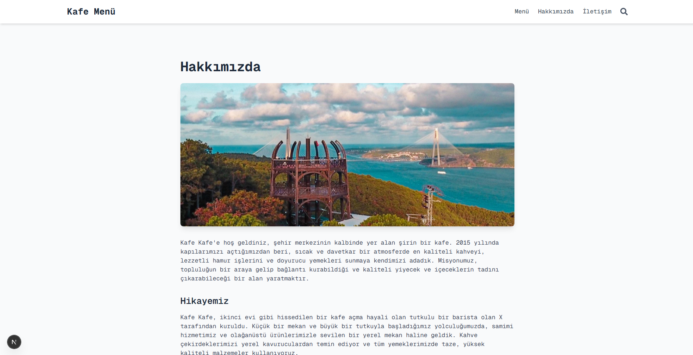

This is a [Next.js](https://nextjs.org) project bootstrapped with [`create-next-app`](https://nextjs.org/docs/pages/api-reference/create-next-app).

## Getting Started

# QR Menü

Kafe/Restoran menünüzü QR kod üzerinden müşterilere sunabileceğiniz, Google Sheets ile içerik yönetimi yapılan, mobil uyumlu bir Next.js uygulaması.

Ana bileşen: `src/components/CafeMenu.tsx`

Uygulama, ürünleri Google Sheets'ten çeker, kategori/alt kategori yapısında listeler, arama yapmanıza ve ürün detaylarını modal pencerede görüntülemenize izin verir.

## Özellikler

- __Google Sheets entegrasyonu__: Ürün verileri (title, category, name, description, imageUrl, price, oldPrice) Google Sheets üzerinden yönetilir ve `/api/sheets` ile çekilir.
- __Kategori ve alt kategoriler__: Menü, ana kategori ve alt kategoriler halinde dinamik olarak oluşturulur.
- __Hızlı arama__: İsim, açıklama, kategori veya başlık üzerinden anlık arama.
- __Ürün detay modalı__: Ürün görseli, açıklaması ve fiyat bilgileri ile modal görüntüleme.
- __Mobil uyumlu tasarım__: Telefon ve tabletlerde akıcı deneyim.
- __Görsel optimizasyonu ve proxy__: Google Drive/Googleusercontent görselleri için `next/image` remotePatterns ve `/api/proxy-image` üzerinden proxy desteği.
- __Modern teknoloji yığını__: Next.js 15, Tailwind CSS v4.

## Kurulum

Önkoşullar:

- Node.js 18+ (önerilen LTS)
- npm (veya pnpm/yarn/bun)

Bağımlılıkları yükleyin:

```bash
npm install
```

Geliştirme sunucusunu başlatın:

```bash
npm run dev
```

Tarayıcıdan şu adresi açın: http://localhost:3000

Prodüksiyon derlemesi ve çalıştırma:

```bash
npm run build
npm start
```

## Google Sheets Yapılandırması

Proje kökünde `credentials.json` dosyası bulunur (Google API kimlik doğrulama bilgileri). Aşağıdaki genel adımlar izlenir:

1. __Google Cloud Projesi__: Google Cloud Console'da bir proje oluşturun. Google Sheets API (gerekirse Google Drive API) etkinleştirin.
2. __Kimlik bilgileri__: OAuth istemci veya servis hesabı kimlik bilgileri oluşturun. İndirilen `credentials.json` dosyasını proje köküne koyun.
3. __Sheet yapısı__: Aşağıdaki alanlara sahip bir çalışma sayfası hazırlayın: `title`, `category`, `name`, `description`, `imageUrl`, `price`, `oldPrice`.
4. __Erişim__: Uygulamanın kullandığı hesap/sunum şekline göre Sheet'i ilgili hesapla paylaşın veya herkese açık görüntülemeye ayarlayın.
5. __Görseller__: Görselleri doğrudan URL olarak `imageUrl` alanına koyun. Google Drive/Docs/Googleusercontent bağlantıları desteklenir; Next.js `next.config.*` içinde ilgili domainler yetkilidir ve `/api/proxy-image` ile proxylenir.

Not: API uç noktaları `src/pages/api/` altında tanımlanır. Bu projede istemci tarafında `axios` ile `/api/sheets` çağrılır. Kendi sayfanıza göre kimlik doğrulama/okuma mantığını düzenleyin.

## Teknolojiler

- Next.js 15, React 19, TypeScript
- Tailwind CSS v4
- Axios
- Google Sheets/Drive API (`googleapis`, `google-spreadsheet`, `@google-cloud/local-auth`)

## Dağıtım

Vercel önerilir:

1. Depoyu Vercel'e bağlayın.
2. Node 18+ ortamı kullanın.
3. Gerekli ise `credentials.json` yerine ortam değişkenleri veya Vercel Secrets kullanarak kimlik bilgilerini yönetin.

Alternatif olarak kendi sunucunuzda `npm run build && npm start` ile çalıştırabilirsiniz.

## İletişim

Geliştirici: `Yusuf Osmanoğlu`

E-posta: `yusufosmanoglu2003@gmail.com`

## Ekran Görüntüleri
  
Aşağıda uygulamadan bazı ekran görüntüleri yer almaktadır:
  

  

  

  

  

  

  

  

  

